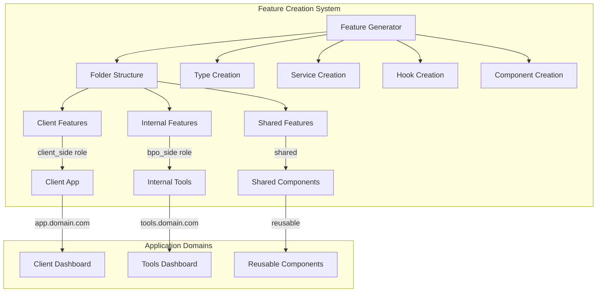

# Design Document - Feature Creation Standards

## Overview

This design document outlines the architectural standards and conventions for creating new features in the ElevaLucro BPO system. The design establishes a consistent, scalable approach to feature development that ensures maintainability, type safety, and uniform user experience across both client-facing and internal tools.

The system follows a feature-first architecture with strict separation between client applications (`elevalucro_bpo_app`) and internal tools (`internal_tools`), each with role-based access control and consistent patterns for components, services, hooks, and types.

## Architecture

### High-Level Architecture



### Feature Organization Strategy

The design implements a **feature-first architecture** where each feature is self-contained with all its dependencies organized in a predictable structure. This approach provides:

- **Locality of Reference**: Related code stays together
- **Scalability**: Easy to add new features without affecting existing ones
- **Maintainability**: Clear boundaries and responsibilities
- **Discoverability**: Consistent structure across all features

### Role-Based Access Control

The system enforces strict role separation:
- **Client Side (`client_side`)**: Access to `elevalucro_bpo_app` features only
- **BPO Side (`bpo_side`)**: Access to `internal_tools` features only
- **Shared Components**: Available to both roles with appropriate permissions

## Components and Interfaces

### 1. Folder Structure Generator

**Purpose**: Creates consistent folder hierarchies for new features

**Interface**:
```typescript
interface FeatureStructure {
  featureName: string;
  domain: 'elevalucro_bpo_app' | 'internal_tools' | 'shared';
  folders: {
    components: boolean;
    hooks: boolean;
    pages: boolean;
    services: boolean;
    types: boolean;
    utils?: boolean;
  };
}

interface FolderGenerator {
  createFeatureStructure(config: FeatureStructure): Promise<void>;
  createIndexFiles(featurePath: string): Promise<void>;
}
```

**Design Rationale**: Standardized folder structure eliminates decision fatigue and ensures all developers can navigate any feature intuitively.

### 2. Type System Generator

**Purpose**: Creates consistent TypeScript types for all features

**Base Type Templates**:
```typescript
// Core entity types
interface BaseEntity {
  id: string;
  created_at: string;
  updated_at: string;
}

interface CreateRequest<T> {
  data: Omit<T, 'id' | 'created_at' | 'updated_at'>;
}

interface UpdateRequest<T> {
  id: string;
  data: Partial<Omit<T, 'id' | 'created_at' | 'updated_at'>>;
}

interface ListResponse<T> {
  data: T[];
  count: number;
  page?: number;
  limit?: number;
}

// Supabase integration types
interface SupabaseEntity extends BaseEntity {
  // Supabase-specific fields
}

// Form validation schemas
interface FormSchema<T> {
  schema: ZodSchema<T>;
  defaultValues: Partial<T>;
}
```

**Design Rationale**: Consistent typing reduces bugs, improves developer experience with autocomplete, and ensures compatibility with Supabase operations.

### 3. Service Layer Architecture

**Purpose**: Standardized API interaction patterns

**Service Interface**:
```typescript
interface BaseService<T extends BaseEntity> {
  // CRUD operations
  create(data: CreateRequest<T>): Promise<T>;
  getById(id: string): Promise<T | null>;
  update(data: UpdateRequest<T>): Promise<T>;
  delete(id: string): Promise<void>;
  list(filters?: FilterParams): Promise<ListResponse<T>>;
  
  // Relationship loading
  loadRelations?(entity: T, relations: string[]): Promise<T>;
  
  // Supabase specific
  getSupabaseClient(): SupabaseClient;
}

interface FilterParams {
  page?: number;
  limit?: number;
  search?: string;
  sortBy?: string;
  sortOrder?: 'asc' | 'desc';
  [key: string]: any;
}
```

**Design Rationale**: Consistent service patterns reduce learning curve, enable code reuse, and provide predictable error handling across all features.

### 4. React Hooks System

**Purpose**: Standardized state management and side effects

**Hook Patterns**:
```typescript
// CRUD hooks
interface UseCRUDHooks<T> {
  useCreate: () => UseMutationResult<T, Error, CreateRequest<T>>;
  useUpdate: () => UseMutationResult<T, Error, UpdateRequest<T>>;
  useDelete: () => UseMutationResult<void, Error, string>;
  useList: (filters?: FilterParams) => UseQueryResult<ListResponse<T>>;
  useGet: (id: string) => UseQueryResult<T>;
}

// Form hooks
interface UseFormHook<T> {
  form: UseFormReturn<T>;
  onSubmit: (data: T) => Promise<void>;
  isLoading: boolean;
  error: Error | null;
}

// Permission hooks
interface UsePermissions {
  hasRole: (role: UserRole) => boolean;
  canAccess: (feature: string) => boolean;
  userRole: UserRole | null;
}
```

**Design Rationale**: Standardized hooks provide consistent loading states, error handling, and cache management across all features.

### 5. Component Architecture

**Purpose**: Reusable, consistent UI components

**Component Hierarchy**:
```typescript
// Base components for each feature
interface FeatureComponents<T> {
  List: React.FC<ListProps<T>>;
  Form: React.FC<FormProps<T>>;
  Detail: React.FC<DetailProps<T>>;
  Card: React.FC<CardProps<T>>;
}

// Shared component interfaces
interface DataTableProps<T> {
  data: T[];
  columns: ColumnDef<T>[];
  loading?: boolean;
  pagination?: PaginationConfig;
  sorting?: SortingConfig;
  filtering?: FilteringConfig;
}

interface FormProps<T> {
  initialData?: Partial<T>;
  onSubmit: (data: T) => Promise<void>;
  validationSchema: ZodSchema<T>;
  loading?: boolean;
}
```

**Design Rationale**: Component standardization ensures UI consistency, reduces development time, and provides accessible, responsive interfaces.

## Data Models

### Supabase Integration Architecture

**Database Schema Integration**:
```typescript
interface SupabaseFeatureIntegration {
  schemas: {
    tables: TableDefinition[];
    views: ViewDefinition[];
    functions: FunctionDefinition[];
    procedures: ProcedureDefinition[];
  };
  rls: {
    policies: RLSPolicy[];
    roles: DatabaseRole[];
  };
  migrations: {
    up: string;
    down: string;
    version: string;
  };
}

interface TableDefinition {
  name: string;
  columns: ColumnDefinition[];
  constraints: ConstraintDefinition[];
  indexes: IndexDefinition[];
  rls_enabled: boolean;
}

interface RLSPolicy {
  table: string;
  name: string;
  command: 'SELECT' | 'INSERT' | 'UPDATE' | 'DELETE';
  roles: string[];
  using: string;
  with_check?: string;
}
```

**Supabase Client Configuration**:
```typescript
interface SupabaseClientConfig {
  url: string;
  anonKey: string;
  serviceRoleKey?: string;
  options: {
    auth: {
      autoRefreshToken: boolean;
      persistSession: boolean;
      detectSessionInUrl: boolean;
    };
    realtime: {
      enabled: boolean;
      channels?: string[];
    };
  };
}

interface SupabaseService<T> extends BaseService<T> {
  client: SupabaseClient;
  tableName: string;
  
  // Supabase-specific methods
  subscribe(callback: (payload: RealtimePayload<T>) => void): RealtimeChannel;
  unsubscribe(channel: RealtimeChannel): void;
  uploadFile(bucket: string, path: string, file: File): Promise<FileUploadResponse>;
  getPublicUrl(bucket: string, path: string): string;
}
```

**Database Structure Alignment**:
- Features must align with existing Supabase schema structure
- Use existing tables: `companies`, `users`, `profiles`, `user_companies`, etc.
- Follow established RLS policies for multi-tenant security
- Leverage existing procedures and functions where applicable
- Maintain compatibility with current migration system

**Edge Functions Integration**:
```typescript
interface EdgeFunctionConfig {
  name: string;
  handler: string;
  cors: {
    allowedOrigins: string[];
    allowedMethods: string[];
  };
  auth: {
    required: boolean;
    roles?: string[];
  };
}

interface EdgeFunctionService {
  invoke<T, R>(
    functionName: string,
    payload: T,
    options?: InvokeOptions
  ): Promise<R>;
}
```

**Supabase Directory Structure Alignment**:
```
supabase/
├── database/
│   ├── schemas/           # Table definitions (001_companies.sql, etc.)
│   ├── procedures/        # Stored procedures (JWT hooks, signup flows)
│   ├── functions/         # Database functions
│   ├── views/            # Database views (health scores, kanban views)
│   └── seeds/            # Initial data
├── functions/            # Edge Functions (client-signup, bpo-signup)
└── migrations/           # Database migrations
```

**Design Rationale**: Direct integration with Supabase structure ensures features work seamlessly with existing database schema, RLS policies, multi-tenant architecture, and Edge Functions ecosystem.

### Feature Metadata Model

```typescript
interface FeatureMetadata {
  name: string;
  domain: 'elevalucro_bpo_app' | 'internal_tools' | 'shared';
  version: string;
  dependencies: string[];
  permissions: {
    roles: UserRole[];
    actions: PermissionAction[];
  };
  routes: RouteConfig[];
  database: {
    tables: string[];
    relationships: RelationshipConfig[];
  };
}

interface RouteConfig {
  path: string;
  component: string;
  layout?: string;
  middleware?: string[];
}

interface RelationshipConfig {
  table: string;
  type: 'one-to-one' | 'one-to-many' | 'many-to-many';
  foreignKey: string;
}
```

### Permission Model

```typescript
interface Permission {
  id: string;
  feature: string;
  action: PermissionAction;
  roles: UserRole[];
  conditions?: PermissionCondition[];
}

type PermissionAction = 'create' | 'read' | 'update' | 'delete' | 'list';
type UserRole = 'client_side' | 'bpo_side' | 'admin';

interface PermissionCondition {
  field: string;
  operator: 'equals' | 'in' | 'not_in';
  value: any;
}
```

## Error Handling

### Centralized Error Management

**Error Boundary Strategy**:
```typescript
interface ErrorBoundaryConfig {
  fallback: React.ComponentType<ErrorFallbackProps>;
  onError: (error: Error, errorInfo: ErrorInfo) => void;
  resetOnPropsChange?: boolean;
}

interface ErrorHandlingService {
  handleApiError: (error: AxiosError) => UserFriendlyError;
  handleValidationError: (error: ZodError) => FieldErrors;
  handlePermissionError: (error: PermissionError) => void;
  logError: (error: Error, context: ErrorContext) => void;
}
```

**Toast Notification System**:
```typescript
interface ToastService {
  success: (message: string, options?: ToastOptions) => void;
  error: (message: string, options?: ToastOptions) => void;
  warning: (message: string, options?: ToastOptions) => void;
  info: (message: string, options?: ToastOptions) => void;
}

interface ToastOptions {
  duration?: number;
  action?: ToastAction;
  dismissible?: boolean;
}
```

**Design Rationale**: Centralized error handling provides consistent user experience, proper error logging, and graceful degradation.

## Testing Strategy

### Testing Architecture

**Test Structure**:
```typescript
interface TestSuite {
  unit: {
    services: ServiceTest[];
    hooks: HookTest[];
    utils: UtilTest[];
  };
  integration: {
    components: ComponentTest[];
    flows: FlowTest[];
  };
  e2e: {
    userJourneys: E2ETest[];
  };
}

interface ServiceTest {
  service: string;
  methods: string[];
  mocks: MockConfig[];
  assertions: Assertion[];
}

interface ComponentTest {
  component: string;
  props: PropTest[];
  interactions: InteractionTest[];
  accessibility: A11yTest[];
}
```

**Testing Patterns**:
1. **Service Layer**: Mock Supabase client, test CRUD operations
2. **Hook Layer**: Use React Testing Library hooks testing utilities
3. **Component Layer**: Test rendering, user interactions, accessibility
4. **Integration**: Test feature workflows with mocked APIs
5. **E2E**: Test critical user journeys across features

**Design Rationale**: Comprehensive testing strategy ensures reliability, prevents regressions, and maintains code quality as features scale.

## Implementation Guidelines

### Development Workflow

1. **Feature Planning**: Define requirements and design
2. **Structure Generation**: Create folder structure and base files
3. **Type Definition**: Define TypeScript interfaces and schemas
4. **Service Implementation**: Build API layer with error handling
5. **Hook Development**: Create React hooks for state management
6. **Component Building**: Develop UI components with accessibility
7. **Route Integration**: Set up routing and permissions
8. **Testing**: Implement comprehensive test suite
9. **Documentation**: Create feature documentation

### Code Quality Standards

- **TypeScript**: Strict mode enabled, no `any` types
- **ESLint**: Next.js configuration with custom rules
- **Prettier**: Consistent code formatting
- **Accessibility**: WCAG 2.1 AA compliance
- **Performance**: Lazy loading, code splitting, optimization

### Environment Configuration

**Automatic Environment Detection**:
```typescript
interface EnvironmentConfig {
  database: {
    local: SupabaseConfig;
    production: SupabaseConfig;
    autoDetection: boolean;
  };
  api: {
    baseUrl: string;
    timeout: number;
  };
  features: {
    [key: string]: boolean;
  };
}

interface SupabaseConfig {
  url: string;
  anonKey: string;
  serviceRoleKey?: string;
}
```

**Environment Detection Strategy**:
- Automatic detection based on hostname and environment variables
- Seamless switching between local development and production
- Feature flags for environment-specific functionality
- Configuration validation on startup

**Design Rationale**: Automatic environment detection reduces configuration errors and simplifies deployment workflows while maintaining security boundaries.

### Security Considerations

- **Role-based Access**: Enforce permissions at route and component level
- **Input Validation**: Zod schemas for all user inputs
- **SQL Injection Prevention**: Use Supabase parameterized queries
- **XSS Protection**: Sanitize user content, use CSP headers
- **Authentication**: JWT token validation, secure session management
- **Environment Isolation**: Automatic detection prevents cross-environment data leaks

This design provides a comprehensive foundation for consistent, scalable feature development while maintaining security, performance, and user experience standards across the ElevaLucro BPO system.